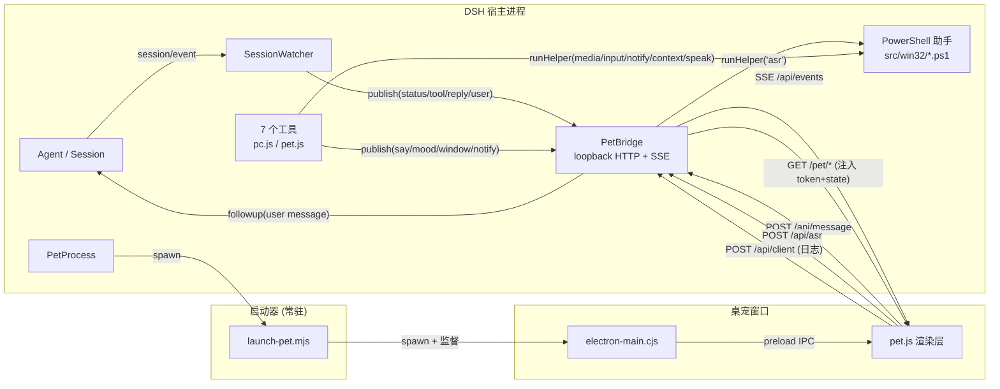

# 架构与数据流

## 三个进程

```
DSH 宿主进程（Cordis fiber: whale-pet）
   │  spawn(node scripts/launch-pet.mjs --url=<pet url> [--hidden] [--no-topmost])
   ▼
启动器 / 监督进程（node，常驻）
   │  spawn(electron.exe  pet/electron-main.cjs --url=…)   或   spawn(msedge.exe --app=…)
   ▼
桌宠窗口进程（Electron BrowserWindow 或 Edge/Chrome app 窗口）
```

| 角色 | 入口 | 职责 |
| --- | --- | --- |
| DSH 宿主 | [`../index.js`](../index.js)、[`../src/bridge.js`](../src/bridge.js)、[`../src/session-watch.js`](../src/session-watch.js)、[`../src/pet-process.js`](../src/pet-process.js)、[`../src/tools/*.js`](../src/tools/pet.js) | 起桥接、镜像会话、注册 7 个工具、启动并跟踪窗口进程。 |
| 启动器 | [`../scripts/launch-pet.mjs`](../scripts/launch-pet.mjs) | 选择外壳（Electron 优先，Edge/Chrome `--app` 兜底），按 `DSH_WHALE_PET_WINDOW` 摆好窗口位置，然后**常驻**监督子进程。 |
| 窗口 | [`../pet/electron-main.cjs`](../pet/electron-main.cjs) + [`../pet/preload.cjs`](../pet/preload.cjs) + [`../pet/pet.js`](../pet/pet.js) | 渲染形象、朗读、录音识别、把用户输入发回宿主；Electron 侧另管托盘、置顶、窗口命令。 |

### 为什么启动器必须常驻

启动器不是“点火即退”的包装器，而是**窗口进程树的根**，这有两个直接后果：

1. **它是 `PetProcess` 跟踪的那个句柄**。[`../src/pet-process.js`](../src/pet-process.js) 的 `running` / `pid` 看的是 `spawn(process.execPath, [launcher, …])` 返回的子进程。启动器若在 spawn Electron 后立刻退出，插件会在窗口还挂在屏幕上时就报告“窗口已关闭”，`pet_window status`、`autoLaunch` 的幂等判断、pid 文件全都会失真。
2. **它是 `taskkill /T` 能连根拔起的树根**。卸载/停止时插件执行 `taskkill /pid <launcher pid> /T /F`：`/T` 杀整棵树，所以 Electron 主进程、GPU/渲染子进程都会一起走；直接对 Electron 下手则会留下子进程。窗口自然退出时启动器跟随退出（`supervise()` 里把退出码转成自己的退出码），插件随之清掉 `%TEMP%\dsh-whale-pet.pid`。

启动器也会转发 `SIGINT` / `SIGTERM` / `exit` 给窗口，所以父进程被收拾时窗口不会变成孤儿。墙上的坑只有一个：宿主被强杀（`taskkill` 不带 `/T`、任务管理器结束进程）时窗口会留下，得用托盘“退出桌宠”或 `pet_window quit` 收尾。

## 回环桥接

[`../src/bridge.js`](../src/bridge.js) 是一个极小的 `node:http` 服务，只绑定回环地址（`config.host` 只允许 `127.0.0.1` / `localhost` / `::1`，其它值直接让插件加载失败）。它同时托管桌宠页面、把宿主事件推给窗口、接收窗口发回的输入。

| 端点 | 方法 | 需要 token | 作用 |
| --- | --- | --- | --- |
| `/pet/*` | `GET` / `HEAD` | 否 | 桌宠窗口的静态资源（`index.html`、`pet.css`、`pet.js`、SVG/PNG）。`/` 与 `/pet/` 解析到该目录的 `index.html`；`..`、NUL、越界路径一律 403；服务 `index.html` 时把启动数据注入占位符。其它方法 405。 |
| `/api/state` | `GET` | 是 | 一次性快照：`{ok:true, value:{sessionId,lastReply,running,voice,asr,window,now,clients}}`。`clients` 是当前 SSE 连接数。 |
| `/api/events` | `GET` | 是 | Server-Sent Events 长连接。先发 `: connected`，随后重放最近 60 条事件，再实时推送；每 25 s 发一次 `: ping` 心跳。 |
| `/api/message` | `POST` | 是 | 窗口 → 会话。体 `{text, source}`；`source === 'voice'` 记为语音，其它一律记为 `text`。`text` 去空白后为空返回 400。成功时 200 `{ok:true,value:{sessionId,messageId}}`；宿主侧失败仍以 200 `{ok:false,error}` 返回，方便窗口直接显示原因。 |
| `/api/client` | `POST` | 是 | 窗口生命周期事件 `{type,message?,mood?}`（`ready`、`boot`、`art`、`error`、`spoke` 等），宿主只写日志，其中 `error` 用更醒目的措辞。 |
| `/api/asr` | `POST` | 是 | 录音转写。体 `{audioBase64, lang}`；空音频 400；`config.asr.enabled === false`、音频为 0 字节、超过 8 MiB、或 `asr.ps1` 报错时返回 200 `{ok:false,error}`。 |
| 其它 `/api/*` | 任意 | 是 | 404 `{ok:false,error:"unknown endpoint …"}`。 |

- **token 校验**：`?token=…` 或 `x-whale-pet-token` 头，两者取其一，必须与本次启动的 token 完全相等，否则 403 JSON。`config.token` 为空时每次启动用 `randomBytes(16).toString('hex')` 现生成。静态资源不做校验——页面自己必须先拿到 token 才能说话。
- **只绑回环**：桥接能模拟键鼠、发通知、把文本注入会话，是个高权限面。绑到可路由地址等于让局域网里任何一台机器都能驱动你的鼠标；`127.0.0.1` 之外没有场景。
- **不发送任何 CORS 头**，所以即便本机浏览器里的恶意页面猜到端口，也读不到响应内容。
- **请求体上限 12 MiB**，超限 413；音频与消息共用这一个限制。

### 启动数据为什么是 `<script type="application/json">`

[`../pet/index.html`](../pet/index.html) 带严格 CSP：

```
default-src 'none'; img-src 'self' data:; style-src 'self' 'unsafe-inline';
script-src 'self'; connect-src 'self'; media-src 'self' blob:
```

页面在服务时把 `<!--WHALE_PET_BOOT-->` 替换成

```html
<script type="application/json" id="whale-pet-boot">{ "token": …, "state": … }</script>
```

- `type="application/json"` **不可执行**，CSP 的 `script-src` 不会拦截它，因此页面不需要开 `'unsafe-inline'`；`pet.js` 用 `JSON.parse(node.textContent)` 读它。
- 数据里的 `<` 被转义成 `\u003c`，避免内容里出现 `</script>` 提前闭合。
- 注入发生在响应时，token 从来不落盘、不进 URL 历史之外的任何地方；同一份 HTML 也不会被别的源读到（无 CORS）。

## 会话事件 → 桌宠行为

[`../src/session-watch.js`](../src/session-watch.js) 监听 `ctx.on('session/event', …)`；只有**当前确实挂着 Agent 的会话**会被考虑（replay 或已销毁的会话不会抢走“活跃”位）。映射如下：

| 会话事件 | 发布的桥接事件 | 窗口行为 |
| --- | --- | --- |
| `turn/start` | `status {state:'thinking', sessionId, turn}` | 显示“思考中”状态药丸；若当前心情是 `idle`/`happy` 则切到 `thinking`。 |
| `turn/end` | `status {state:'idle', …}` | 收起状态药丸；心情从 `thinking`/`working` 回到 `idle`。 |
| `assistant/message` | `reply {sessionId, turn, step, interrupted, text, utterances, speak}` | 气泡显示清洗后的原文；`utterances` 依次朗读；心情 `happy` 6 秒。仅当 `voice.enabled && voice.speakReplies` 才会发；纯代码回复（清洗后为空）不发。同时把最后一条回复记进快照的 `lastReply`。 |
| `tool/call` | `tool {phase:'start', name, sessionId, label}` | 状态药丸“执行 &lt;label&gt;”，心情 `working`。`label` 是工具名，超过 40 字符截断加省略号。 |
| `tool/result` | `tool {phase:'end', name, sessionId, isError, label}` | 回到 `idle`；`isError === true` 时切 `surprised` 3 秒。 |

`tool/result` 事件里不重复工具名，所以 watcher 用 `callId → name` 的 Map 暂存（`tool/call` 写入、`tool/result` 读出并删除）；查不到时名字回落为 `tool`。每个会话的运行状态记在 `#running` 集合里，供 `/api/state` 的 `running` 字段使用。

窗口侧还处理 `say`（`pet_say`）、`mood`（`pet_mood`）、`notify`（`pet_notify` 的气泡）、`user`（用户消息回显）、`window`（窗口命令）与 `config`。注意 `config` 分支目前是**死代码**：宿主没有任何地方 `publish('config', …)`，语音/识别设置只在页面加载时由启动数据给定。

### `session.mode` 如何选择目标会话

| 模式 | 目标 | 说明 |
| --- | --- | --- |
| `active`（默认） | 最近一次产生事件的会话；还没有任何事件时取 `ctx.agents.list()[0]` | 保证“刚打开窗口就能说话”。 |
| `pinned` | 固定 `config.session.id` 对应的 Agent | 需要同时给出 `session.id`，否则加载即报错。 |
| `none` | 无 | 只观察、不说话；窗口发消息会失败，回一句“没有可对话的会话”。 |

目标会话同时决定三件事：镜像是谁的（`active` 只跟随它，`pinned`/`none` 下快照里的 `sessionId` 也按它算）、`/api/message` 落到哪、以及 `running` 状态取自谁。

### 用户消息为什么是手写的

`SessionWatcher.sendUserText()` 直接构造：

```js
{ id: randomUUID(), role: 'user', content: [{ type: 'text', text }], source: { kind: 'user' } }
```

然后走公开的 `agent.followup(message)`（与 harness 自己的 reminder producer 同一条路径），再 `publish('user', …)` 并返回 `{sessionId, messageId}`。不 import `@deepseek-ai/dsh-llm` 的 `createUserMessage` 是因为整个插件是**纯 ESM、无构建步骤、不依赖 harness 包**的：一旦 import，插件就得和宿主的包实例/解析顺序绑在一起，profile 里就会出现第二份 harness 包的风险。注释里说明 `createUserMessage` 的等价实现是 `deepFreeze(structuredClone({role, content, source, id: randomUUID()}))`；当前实现复刻了字段，但没有做 `deepFreeze`，这是唯一的差别（未观察到依赖冻结行为的调用方）。

## 工具注册

工具是原生的 `ToolDefinition` 对象，由 [`../src/tools/pc.js`](../src/tools/pc.js) 与 [`../src/tools/pet.js`](../src/tools/pet.js) 构造成数组，[`../index.js`](../index.js) 按配置筛选后 `ctx.tools.register(tool)`：

| 字段 | 作用 |
| --- | --- |
| `name` / `description` | 给模型的工具名与中文说明。 |
| `parameters` | JSON Schema（`type`/`properties`/`required`/`additionalProperties`/`enum`），harness 在注册时会强制这个子集。 |
| `output.schema` | 结果对象形状（`{type:'object', additionalProperties:true}`）。 |
| `output.render(args, value)` | 把结果转成模型读到的一行/一块文本。 |
| `execute(args, exec)` | 真正的动作，`exec.signal` 用于取消（透传给助手进程）。 |
| `isConcurrencySafe` | 目前只有 `pet_look` 声明为 `true`（只读）。 |
| `presentCall(args)` | 调用卡片元数据（标题、kind、原始入参）。 |

不用 harness 的 `defineTool` 是同一个理由：它是 harness 包里的辅助函数，而这个插件刻意不 import 任何 harness 包（也没有 Schemastery `Config` 导出，配置在 [`../src/config.js`](../src/config.js) 里自己校验、出错就大声失败）。代价是 JSON Schema 子集、`output.render` 的存在性这些约束得自己守，所以 [`../tests/plugin-entry.test.mjs`](../tests/plugin-entry.test.mjs) 里有一个镜像 harness 白名单的 schema 走查。

## 数据流



用户消息的回环是完整的一圈：窗口点发送 → `/api/message` → `SessionWatcher.sendUserText` → `agent.followup` → 新的一轮会话事件 → `status`/`reply` 推回窗口。
